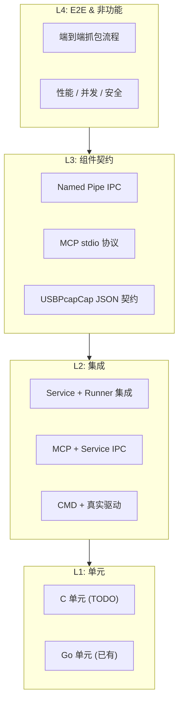

# USBPcap AI MCP 测试验收方案

> 版本: 1.0  
> 日期: 2026-07-10  
> 覆盖: USBPcapCap (C) / USBPcapService (Go) / USBPcapMCP (Go)  
> 参照: `doc/usbpcap-ai-mcp-plan-design-implementation.md` 第 11 节验收标准

---

## 目录

1. [测试策略总览](#1-测试策略总览)
2. [测试环境矩阵](#2-测试环境矩阵)
3. [分层测试用例](#3-分层测试用例)
   - [L0: 单元测试](#l0-单元测试)
   - [L1: 集成测试](#l1-集成测试)
   - [L2: 组件契约测试](#l2-组件契约测试)
   - [L3: 端到端测试](#l3-端到端测试)
     - [3.3.1 用户场景 E2E](#331-用户场景-e2ep0-发布必测)
     - [3.3.2 错误路径 E2E](#332-错误路径-e2ep0)
     - [3.3.3 真实设备抓包专项：鼠标测试套件](#333-真实设备抓包专项鼠标测试套件p0-发布前必测)
   - [L4: 非功能测试](#l4-非功能测试)
4. [回归测试套件](#4-回归测试套件)
5. [发布门禁清单](#5-发布门禁清单)
6. [测试数据与基础设施](#6-测试数据与基础设施)
   - [6.1 合成 pcap 数据集](#61-合成-pcap-数据集)
   - [6.2 物理测试设备](#62-物理测试设备)
   - [6.3 CI 集成建议](#63-ci-集成建议)
   - [6.4 测试辅助脚本](#64-测试辅助脚本)
   - [6.5 鼠标抓包自动化测试脚本](#65-鼠标抓包自动化测试脚本)
   - [6.6 预采集鼠标参考 pcap 数据集](#66-预采集鼠标参考-pcap-数据集)

---

## 1. 测试策略总览

### 1.1 测试金字塔



### 1.2 已有测试资产（基线）

| 层次 | 文件 | 覆盖范围 |
|------|------|----------|
| Go 单元 | `pcap/analyze_test.go` | pcap 解析、端点统计、导出 |
| Go 单元 | `pcap/summary_test.go` | pcap 摘要统计 |
| Go 单元 | `service/config_test.go` | 配置存取、校验 |
| Go 单元 | `service/server_test.go` | 请求校验、任务管理、并发互斥 |
| Go 单元 | `cmd/usbpcap-mcp/main_test.go` | 工具定义完整性 |
| Go 集成 | `usbpcapcmd/runner_integration_test.go` | CLI JSON 输出、参数构建 |

### 1.3 测试执行策略

- **PR 门禁**（< 5 分钟）: L0 全部 + L1 Go 单元
- **每日构建**（< 15 分钟）: L0 + L1 + L2（不含真硬件）
- **发布前**（按需）: L0–L4 全量 + **鼠标真实设备测试套件**
- **真硬件测试**: 仅 L2 CMD_INT + L3 E2E + **L3 鼠标专项 (HW-MS-***)** 的子集，需要物理 USB 设备

---

## 2. 测试环境矩阵

### 2.1 操作系统

| OS | 优先级 | 说明 |
|----|--------|------|
| Windows 11 x64 | P0 | 主要目标 |
| Windows 10 x64 | P1 | 兼容性 |
| Windows Server 2022 | P2 | 服务模式重点 |

### 2.2 权限级别

| 场景 | 权限 | 用途 |
|------|------|------|
| 管理员 | Elevated | 驱动安装、服务安装、直接抓包 |
| 普通用户 | Standard | MCP 调用、服务模式抓包 |
| LocalSystem | Service | 服务运行时 |

### 2.3 硬件要求

| 条件 | 测试用途 |
|------|----------|
| 无 USB 设备 | 空接口测试、错误路径 |
| 已知 VID/PID 的 USB 设备 | 精确过滤测试 |
| 多设备多 Hub | 多设备并发、地址映射 |
| 热插拔设备 | `--capture-from-new-devices` 测试 |
| **USB HID 鼠标（任何品牌）** | **真实设备抓包核心——中断传输、多 endpoint、可复现的流量模式** |
| **USB HID 键盘（可选）** | **补充 HID 场景——方向单一、批量 interrupt IN 流量** |

---

## 3. 分层测试用例

---

### L0: 单元测试

#### 3.0.1 Go 单元测试增强（P0: 现有缺口）

| ID | 用例 | 输入 | 期望 |
|----|------|------|------|
| UT-GO-001 | `pcap.OpenReader` 损坏文件 | 截断的 pcap | 返回明确错误，不 panic |
| UT-GO-002 | `pcap.OpenReader` 空文件 | 0 字节文件 | 返回 EOF |
| UT-GO-003 | `pcap.Analyze` 超大 headerLen | headerLen=0xFFFF | 安全跳过，不 OOM |
| UT-GO-004 | `pcap.ExportPayload` 超 10000 条 | 10万条数据 | 截断为 10000 条 |
| UT-GO-005 | `pcap.ExportPayload` 超 64MiB | 大 payload | 截断 |
| UT-GO-006 | `pcap.transferTypeName` 所有枚举 | 0/1/2/3/0xFE/0xFF/其他 | 正确映射 |
| UT-GO-007 | `pcap.dataLenBucket` 边界值 | 0/1/8/9/64/65/256/.../4096/4097 | 正确分桶 |
| UT-GO-008 | `usbpcapcmd.BuildCaptureArgs` 全参数组合 | 参见已有 `TestBuildCaptureArgs` | ✅ 已有，需补 endpoint+transferType+storeMode 组合 |
| UT-GO-009 | `service.normalizeHex` 边界 | 空串 / "0x" / "0xZZ" / "123456789" | 合理处理 |
| UT-GO-010 | `service.normalizeRequest` 全字段 | 17 个字段全填 | 全部规范化 |
| UT-GO-011 | `service.defaultOutputPath` 遍历防护 | `../../Windows/System32/config/SAM` | 只取 basename |
| UT-GO-012 | `ipc.Request` JSON 序列化往返 | 全字段 → JSON → 反序列化 | 字段不丢失 |
| **UT-GO-013** | **`pcap.Analyze` 鼠标参考 pcap（静止）** | `mouse_static_3s.pcap` | packetCount 少（< 50），端点分布主要含 1 个 interrupt IN endpoint |
| **UT-GO-014** | **`pcap.Analyze` 鼠标参考 pcap（移动）** | `mouse_move_5s.pcap` | packetCount > 50，interrupt IN 包数占多数，payload 长度在 HID report 范围内 (3-8) |
| **UT-GO-015** | **`pcap.ExportPayload` 鼠标移动帧** | `mouse_move_5s.pcap`, ep=0x81 | 返回 hex 数据每行 ≤ 8 字节，连续行间 byte[1..2] 有位移变化 |
| **UT-GO-016** | **`pcap.Summarize` 鼠标参考 pcap** | `mouse_click_left.pcap` | transferTypes.interrupt > 0, endpointDistribution 含 0x81, deviceDistribution 非空 |

#### 3.0.2 C 单元测试（P2: 可后续补齐）

> 当前 C 侧无单元测试框架。建议引入 `cmocka` 或简单 `assert` 宏做 smoke test。

| ID | 用例 | 说明 |
|----|------|------|
| UT-C-001 | `parse_u32_value` / `parse_u16_value` | 边界值、溢出、hex/dec |
| UT-C-002 | `parse_transfer_type` | 大小写不敏感、非法值 |
| UT-C-003 | `transfer_type_to_text` | 所有枚举映射 |
| UT-C-004 | `json_print_escaped` | 特殊字符转义正确性 |
| UT-C-005 | VID/PID → address 匹配 | 多设备场景、部分匹配 |
| UT-C-006 | `app_capture_filter` 匹配逻辑 | VID/PID/endpoint/transfer 组合条件 |

---

### L1: 集成测试

#### 3.1.1 Service + Runner 集成（P0）

| ID | 用例 | 前置条件 | 操作 | 期望 |
|----|------|----------|------|------|
| IT-SRV-001 | `listInterfaces` 返回空（无驱动） | 未安装 USBPcap 驱动 | 调用 listInterfaces | 不报错，返回空 `[]` |
| IT-SRV-002 | `captureOnce` 无匹配设备 | 驱动已安装，VID=0xdead | 发起 captureOnce | ErrorCode=`NO_MATCHED_DEVICE` |
| IT-SRV-003 | `captureOnce` 正常抓包 | 目标设备已连接 | VID 匹配 + `durationSeconds=3` | pcapPath 非空，summary.packetCount > 0 |
| IT-SRV-004 | `startCapture` + `waitCaptureTask` 异步 | 同上 | start → 轮询 status → wait | task 状态从 running → completed |
| IT-SRV-005 | `stopCapture` 中途停止 | 正在抓包 | stopCapture | task 状态变为 canceled |
| IT-SRV-006 | 并发抓包互斥 | 已有 active capture | 再发 startCapture | ErrorCode=`CAPTURE_ALREADY_RUNNING` |
| IT-SRV-007 | `on-match` 未触发 | 无匹配流量 | storeMode=on-match, duration=5 | triggered=false, pcapPath 为 null |
| IT-SRV-008 | `on-match` 触发 | 目标设备有 IN 流量 | endpoint=0x81, storeMode=on-match | triggered=true, pcapPath 非空 |
| IT-SRV-009 | 历史任务列表 | 已完成多个 capture | listCaptureTasks | 返回历史任务，按时间倒序 |
| IT-SRV-010 | `autoInterface` 自动选择 | 多接口，仅一个连了目标 | autoInterface + VID | 正确选择接口 |
| IT-SRV-011 | `getConfig` 返回配置 | 服务运行中 | getConfig | 返回 captureDir/cmdPath/pipeName |
| IT-SRV-012 | `analyze` 分析已抓 pcap | pcapPath 有效 | analyze | 返回 endpoint 分布、payload 统计 |
| IT-SRV-013 | `diagnoseCapture` 诊断空闲 | 刚完成一个 idle 任务 | diagnoseCapture(taskId) | 给出 diagnosis + recommendation |

#### 3.1.2 MCP + Service IPC 集成（P0）

| ID | 用例 | 前置条件 | 操作 | 期望 |
|----|------|----------|------|------|
| IT-MCP-001 | `tools/list` 返回所有工具 | Service 运行 | MCP stdio 握手 | 返回 ≥17 个 tool |
| IT-MCP-002 | `usbpcap_list_interfaces` | Service 运行 | 调用 | 返回 interfaces 数组 |
| IT-MCP-003 | `usbpcap_list_devices` | 接口存在 | 指定 interface | 返回 devices 含 VID/PID |
| IT-MCP-004 | `usbpcap_probe_device` 自动查找 | 设备已连接 | VID/PID | 找到 interface + address |
| IT-MCP-005 | `usbpcap_smart_capture` 完整流程 | 设备已连接 | VID + endpoint + duration=5 | 返回 pcapPath + summary + nextAction |
| IT-MCP-006 | `usbpcap_capture_once` 同步 | 设备已连接 | 同上 | 返回 pcapPath + summary |
| IT-MCP-007 | `usbpcap_help` 所有子主题 | 无 | help, help capture, help filter... | 返回 markdown 帮助文本 |
| IT-MCP-008 | `usbpcap_install_guide` | 无 | 调用 | 返回安装指南 markdown |
| IT-MCP-009 | `usbpcap_service_control status` | Service 运行 | status | 返回服务状态 |

#### 3.1.3 CMD + 真实驱动集成（P1: 需物理设备）

| ID | 用例 | 前置条件 | 命令 | 期望 |
|----|------|----------|------|------|
| IT-CMD-001 | `--list-interfaces --json` | 驱动已安装 | 执行 | 输出合法 UTF-8 JSON，interfaces 数组 |
| IT-CMD-002 | `--list-devices --device X --json` | 接口有效 | 执行 | devices 含 address/vendorId/productId |
| IT-CMD-002M | **鼠标设备识别** | USB 鼠标已连接 | `--list-devices --device X --json` | 返回的 devices 中至少一个条目 description 含 "mouse"/"HID"/"pointer"，vendorId ≠ 0 |
| IT-CMD-002M2 | **鼠标端点枚举** | 鼠标已连接 | 枚举后记录鼠标 address 和其 endpoint 列表 | 鼠标至少有一个 IN endpoint (0x81/0x82 等)，transferType=interrupt |
| IT-CMD-003 | `--vendor-id 0xXXXX --duration 5` | 目标设备存在 | 抓包 5s | 仅含目标设备流量 |
| IT-CMD-004 | `--vendor-id + --product-id` 双重过滤 | 同 VID 多 PID | 指定 PID | 仅含目标 PID 设备 |
| IT-CMD-005 | `--auto-interface --vendor-id` | 目标在一个接口上 | 自动选择 | 正确选择接口并抓包 |
| IT-CMD-006 | `--endpoint 0x81 --app-filter` | 目标有 EP81 流量 | 应用层过滤 | 写入文件仅含 EP81 帧 |
| IT-CMD-007 | `--transfer-type bulk --app-filter` | 目标有 bulk 流量 | 仅 bulk | 不含 control/interrupt 帧 |
| IT-CMD-008 | `--store-mode on-match --endpoint` | 目标有匹配流量 | 触发存储 | triggered=true |
| IT-CMD-009 | `--store-mode on-match` 无匹配 | 超时前无匹配 | 等超时 | triggered=false, output=null |
| **IT-CMD-010M** | **鼠标 interrupt IN 过滤 --endpoint** | 鼠标已连接, 知道其 IN endpoint | `--vendor-id MOUSE_VID --endpoint 0x81 --app-filter --duration 10` | 结果 pcap 中所有帧的 endpoint 均为指定值, 无 control 或其他帧 |
| **IT-CMD-011M** | **鼠标 on-match 触发存储** | 鼠标已连接 | `--vendor-id MOUSE_VID --endpoint 0x81 --app-filter --store-mode on-match --duration 30` | 移动鼠标后 triggered=true, pcap 非空 |
| **IT-CMD-012M** | **鼠标 on-match 空闲无触发** | 鼠标已连接但静止 | `--store-mode on-match --duration 5` | triggered=false, 无 pcap 文件 |
| **IT-CMD-013M** | **鼠标静默期后移动触发** | 鼠标静止 3s → 移动 2s | `--store-mode on-match --duration 10` | triggered=true, pcap 包含移动后的 interrupt 帧 |
| IT-CMD-010 | `--help capture / filter / json / examples` | 无 | 分层帮助 | 输出清晰可读 |

---

### L2: 组件契约测试

#### 3.2.1 CLI JSON Schema 契约（P0: 自动化）

| ID | 契约项 | Schema 要求 |
|----|--------|------------|
| CT-CLI-001 | `list-interfaces` 输出 | `{interfaces: [{name, displayName}]}` — name 以 `\\.\USBPcap` 开头 |
| CT-CLI-002 | `list-devices` 输出 | `{interface, devices: [{address, vendorId, productId, ...}]}` |
| CT-CLI-003 | `capture` 成功输出 | `{ok:true, output, storeMode, triggered, matchedDevices:[{address, vendorId, productId}]}` |
| CT-CLI-004 | `capture` 失败输出 | `{ok:false, errorCode, message, hint}` — errorCode 为稳定枚举值 |
| CT-CLI-005 | JSON 编码 | UTF-8, 无 BOM, `\n` 结尾 |
| CT-CLI-006 | stdout/stderr 分离 | `--json` 模式下 stdout 仅 JSON, stderr 仅诊断 |

#### 3.2.2 Named Pipe IPC 契约（P0）

| ID | 契约项 | 验证方法 |
|----|--------|----------|
| CT-IPC-001 | 连接拒绝 | 服务未启动时 client.Connect 超时 < 5s |
| CT-IPC-002 | 请求-响应 JSON 格式 | `{action, ...}` → `{ok, ...}` 往返 |
| CT-IPC-003 | 未知 action | 返回 `{ok:false, errorCode:"UNKNOWN_ACTION"}` |
| CT-IPC-004 | 字段校验 | 必填字段缺失 → 明确 errorCode |
| CT-IPC-005 | 并发连接 | 多个 client 同时连接均能处理 |
| CT-IPC-006 | 大响应 | summary 包含大量 endpoint 时不截断 |

#### 3.2.3 MCP stdio 协议契约（P0）

| ID | 契约项 | 验证方法 |
|----|--------|----------|
| CT-MCP-001 | `initialize` 握手 | 返回 serverInfo + capabilities |
| CT-MCP-002 | `tools/list` | 每个 tool 含 name/description/inputSchema |
| CT-MCP-003 | `tools/call` 成功 | `{content:[{type:"text", text:"..."}], isError:false}` |
| CT-MCP-004 | `tools/call` 失败 | `{content:[{type:"text", text:"..."}], isError:true}` |
| CT-MCP-005 | JSON-RPC 错误 | 格式错误返回 `{error:{code, message}}` |
| CT-MCP-006 | 未知方法 | 返回 MethodNotFound |

---

### L3: 端到端测试

#### 3.3.1 用户场景 E2E（P0: 发布必测）

| ID | 场景 | 步骤 | 验收标准 |
|----|------|------|----------|
| E2E-001 | **首次部署流程** | 1) 解压 zip 2) (管理员) `driver-install` 3) (管理员) `service install` 4) `service start` 5) 普通用户调用 MCP | 驱动加载、服务运行、MCP 可列出接口 |
| E2E-002 | **免 UAC 抓包** | 普通用户 → MCP `smart_capture` (VID, duration=5) | 弹窗 0 次，返回 pcapPath |
| E2E-003 | **AI 工具调用完整链路** | VS Code Copilot → `usbpcap_probe_device` → `usbpcap_smart_capture` → `usbpcap_analyze` | 每步返回结构化结果 |
| E2E-004 | **诊断工作流** | capture 返回 idle → `usbpcap_diagnose_capture` → 根据建议修复 → 重新 capture 成功 | 诊断结果有 actionable 建议 |
| E2E-005 | **Profile → Capture → Export 工作流** | 1) `profile_device` (VID) 2) 根据推荐 endpoint 做 `smart_capture` 3) `export_data` 导出 hex | 导出格式正确，endpoint 匹配 |
| E2E-006 | **长时间监测 on-match** | 1) `startCapture` (on-match, endpoint, duration=3600) 2) 插入/操作设备 3) `waitCaptureTask` | 触发前无文件、触发后有 pcap |
| E2E-007 | **多 MCP 工具并行调用** | 同时调 list_interfaces + status | 两个请求均正常返回，不互相阻塞 |

#### 3.3.2 错误路径 E2E（P0）

| ID | 场景 | 触发条件 | 期望错误 |
|----|------|----------|----------|
| E2E-ERR-001 | 无驱动 | 驱动未安装 | `DRIVER_NOT_INSTALLED` 或 `NO_INTERFACES` |
| E2E-ERR-002 | 服务未运行 | `MCP` 启动后 Service 未启动 | MCP 自动启动 foreground 模式或明确报错 |
| E2E-ERR-003 | 无匹配设备 | VID=0xdead | `NO_MATCHED_DEVICE` + 建议 list-devices |
| E2E-ERR-004 | 输出目录无权限 | captureDir 不可写 | 明确错误+路径 |
| E2E-ERR-005 | 超时 | 抓包 duration 耗尽 | 正常返回，不残留进程 |
| E2E-ERR-006 | MCP 进程崩溃 | 杀掉 USBPcapMCP.exe | Service 不受影响，下次请求正常 |
| E2E-ERR-007 | Service 崩溃恢复 | 杀掉 USBPcapService.exe | SCM 自动重启（如配置），历史任务不丢 |
| E2E-ERR-008 | 磁盘空间不足 | captureDir 磁盘满 | 明确 `DISK_FULL` 错误，自动清理 |

---

#### 3.3.3 真实设备抓包专项：鼠标测试套件（P0: 发布前必测）

鼠标是最理想的真实 HID 测试设备——几乎每台机器都有、流量模式可预测（静止时有周期性 SOF/空闲，移动时有 interrupt IN 帧）、端点结构简单。以下测试覆盖抓包全链路在真实鼠标上的行为。

##### 3.3.3.1 测试准备

```powershell
# 步骤 A: 识别鼠标
$mouseVid = (USBPcapCap.exe --list-devices --device \\.\USBPcap1 --json |
    ConvertFrom-Json).devices |
    Where-Object { $_.description -match "mouse|HID|pointer|Mice" } |
    Select-Object -First 1 -ExpandProperty vendorId

if (-not $mouseVid) { throw "未找到鼠标，请确认 USB 鼠标已连接" }
Write-Host "鼠标 VID=$mouseVid"

# 步骤 B: 确定鼠标端点（可选，用于精确过滤）
$mouseAddr = (USBPcapCap.exe --list-devices --device \\.\USBPcap1 --json |
    ConvertFrom-Json).devices |
    Where-Object { $_.vendorId -eq $mouseVid } |
    Select-Object -First 1 -ExpandProperty address

# 快速采样识别活跃端点
USBPcapCap.exe --device \\.\USBPcap1 --vendor-id $mouseVid --duration 3 `
    --output temp_mouse_profile.pcap --json --no-interactive
# 然后用 --analyze 或 usbpcap_analyze 查看 endpoint 分布
```

##### 3.3.3.2 基础抓包验证

| ID | 场景 | 操作 | 验收标准 |
|----|------|------|----------|
| HW-MS-001 | **鼠标 VID 精确过滤** | `--vendor-id MOUSE_VID --duration 5` | 生成的 pcap 用 `usbpcap_analyze` 检查：packetCount > 0，所有帧的 device address 匹配鼠标 |
| HW-MS-002 | **鼠标静止流量模式** | 不移动鼠标，`--duration 3` | pcap 非空但包数较少（仅 SOF/URB 空闲帧），平均 payload 长度小的包占多数 |
| HW-MS-003 | **鼠标移动产生 interrupt 流量** | `--vendor-id MOUSE_VID --duration 5`，期间持续移动鼠标 | 与 HW-MS-002 相比 packetCount 明显增加（至少 2×），IN endpoint 包数 > 0 |
| HW-MS-004 | **鼠标 endpoint 应用层过滤** | `--endpoint MOUSE_IN_EP --app-filter --duration 5` + 移动鼠标 | pcap 中所有帧的 endpoint 均为指定值，无 control/OUT 帧 |
| HW-MS-005 | **鼠标 transfer-type 过滤** | `--transfer-type interrupt --app-filter --duration 5` + 移动鼠标 | pcap 中所有帧的 transferType 均为 interrupt |
| HW-MS-006 | **鼠标 endpoint + transfer-type 组合过滤** | `--endpoint MOUSE_IN_EP --transfer-type interrupt --app-filter --duration 5` | 帧数 > 0，全部符合双重条件 |
| HW-MS-007 | **鼠标控制帧单独过滤** | `--endpoint 0x00 --transfer-type control --app-filter --duration 5` | 帧数可能很少或为 0，但不能崩溃或超时 |

##### 3.3.3.3 触发式存储（on-match）验证

| ID | 场景 | 操作 | 验收标准 |
|----|------|------|----------|
| HW-MS-010 | **鼠标静止不触发** | 鼠标静止 8s，`--store-mode on-match --duration 8` | triggered=false，无 pcap 文件生成 |
| HW-MS-011 | **鼠标移动触发** | 静止 3s → 移动 3s，`--store-mode on-match --duration 10` | triggered=true，pcap 包含移动后 interrupt 帧，不含静止期帧 |
| HW-MS-012 | **鼠标断开不触发** | 前 5s 正常，拔鼠标后 5s，`--store-mode on-match --duration 10` | triggered 状态取决于是否有匹配帧 |
| HW-MS-013 | **on-match + endpoint 双重触发条件** | `--endpoint MOUSE_IN_EP --store-mode on-match --app-filter --duration 15` | triggered=true，pcap 仅含 IN 帧 |
| HW-MS-014 | **长时间监测 on-match 中途多次触发** | `--store-mode on-match --duration 60`，间歇移动鼠标 | triggered=true，pcap 大小合理（不因 idle 期白白增长） |

##### 3.3.3.4 Profile → Capture → Export 工作流

| ID | 场景 | 操作 | 验收标准 |
|----|------|------|----------|
| HW-MS-020 | **Profile 鼠标识别端点** | MCP `usbpcap_profile_device` (VID) | 返回 endpoints 列表中包含 interrupt IN 端点（如 0x81），推荐配置中含 endpoint 值 |
| HW-MS-021 | **Profile → SmartCapture 链路** | profile 拿到推荐 endpoint → `usbpcap_smart_capture` (VID, endpoint, duration=5) + 移动鼠标 | 返回 pcapPath + summary，summary.endpointDistribution 含该 endpoint |
| HW-MS-022 | **Export 鼠标 payload** | smart_capture 得到 pcap → `usbpcap_export_data` (pcapPath, endpoint=0x81, format=hex) | 返回 hex 数据，每个 payload 长度 ≤ 鼠标 HID report 长度（通常 3-8 字节） |
| HW-MS-023 | **Export 鼠标 CSV 格式** | 同上 format=csv | 返回逗号分隔的 hex 数据，每行一个帧 |

##### 3.3.3.5 鼠标 payload 正确性验证

| ID | 场景 | 操作 | 验收标准 |
|----|------|------|----------|
| HW-MS-030 | **鼠标移动数据解读** | 导出 IN endpoint hex payload | 连续帧的 payload 符合 HID mouse 协议（第 0 字节 button，第 1-2 字节 X/Y 位移），位移值随移动方向变化 |
| HW-MS-031 | **鼠标点击事件捕获** | 抓包中点击鼠标左键 | payload 第 0 字节 bit0 从 0→1，释放后从 1→0 |
| HW-MS-032 | **鼠标左右键区分** | 分别点击左键、右键 | 左键 bit0=1，右键 bit1=1（第 0 字节） |
| HW-MS-033 | **鼠标滚轮事件** | 滚动滚轮 | payload 中出现非零 Z 轴位移（通常第 3 字节） |

##### 3.3.3.6 服务模式免 UAC 鼠标签包

| ID | 场景 | 操作 | 验收标准 |
|----|------|------|----------|
| HW-MS-040 | **Service 运行中的普通用户鼠标签包** | Service 已运行，普通用户调 `usbpcap_capture_once` (VID) | 返回 pcapPath，不弹 UAC 窗口 |
| HW-MS-041 | **Service 无鼠标时明确提示** | 拔掉鼠标，Service 运行 | 返回 `NO_MATCHED_DEVICE`，hint 提示 "请连接鼠标" |
| HW-MS-042 | **Service 多鼠标环境选择** | 同时连接 2 只鼠标 (VID 不同) | 按指定 VID 精确过滤，两只鼠标流量互不串扰 |

---

### L4: 非功能测试

#### 3.4.1 安全测试（P0）

| ID | 用例 | 攻击向量 | 期望 |
|----|------|----------|------|
| SEC-001 | 路径遍历防护 | outputFileName=`../../Windows/System32/evil.pcap` | 仅 basename 生效 |
| SEC-002 | 命令注入防护 | vendorId=`0x1234 && del /f C:\Windows` | 参数按白名单拼接，不执行 shell |
| SEC-003 | Named Pipe ACL | 非授权用户连接 | 拒绝访问 |
| SEC-004 | 大文件限制 | --duration=86400 无限制 | maxFileSizeBytes 生效，自动截断 |
| SEC-005 | 内存限制 | 超大 pcap 解析 | ExportPayload 限制 10000 条 + 64MiB |
| SEC-006 | DoS 防护 | 1000 个并发 IPC 连接 | 不崩溃，合理排队或拒绝 |
| SEC-007 | 日志无敏感数据 | 抓包含敏感 payload | 日志仅含元数据，不含 payload 内容 |

#### 3.4.2 乱码测试（P0）

| ID | 用例 | 环境 | 验证 |
|----|------|------|------|
| ENC-001 | `--json` 输出到 PowerShell 管道 | pwsh `USBPcapCap.exe --json | ConvertFrom-Json` | 无解析错误 |
| ENC-002 | `--json` 输出到 cmd 重定向 | cmd `/c USBPcapCap.exe ... > out.json` | JSON 有效 UTF-8 |
| ENC-003 | Go `exec.Command` 捕获输出 | `cmd.Stdout` 读 | Unmarshal 成功 |
| ENC-004 | `--help` 中文不乱码 | 中文系统 | 帮助文本正确显示 |
| ENC-005 | 错误信息含中文设备名 | 中文 USB 设备描述符 | JSON escape 正确 |
| ENC-006 | MCP output 中文 | `usbpcap_help` 返回中文 | AI 工具正常渲染 |

#### 3.4.3 性能测试（P1）

| ID | 指标 | 目标 | 测试方法 |
|----|------|------|----------|
| PERF-001 | `list_interfaces` 响应 | < 1s | 无驱动 / 有驱动 |
| PERF-002 | `list_devices` 响应 | < 3s | 5 设备 Hub |
| PERF-003 | `analyze` 10K 包 | < 5s | 预生成 10K 包 pcap |
| PERF-004 | `ExportPayload` 大 pcap | < 30s | 2K 包 × 4KB |
| PERF-005 | IPC 请求往返延迟 | < 100ms P99 | 空 action="status" |
| PERF-006 | 内存占用（idle） | < 50MB | Service + MCP 进程 |
| PERF-007 | 内存占用（capture） | < 200MB | 10 分钟 on-match 监测 |
| PERF-008 | 子进程无泄露 | 0 残留 | 连续 20 轮 captureOnce 后无 `USBPcapCap.exe` 残留 |

#### 3.4.4 兼容性测试（P1）

| ID | 用例 | 条件 | 期望 |
|----|------|------|------|
| CMP-001 | PowerShell 5.1 | Windows 10 默认 | MCP + Service 正常 |
| CMP-002 | PowerShell 7 | pwsh.exe | 同上 |
| CMP-003 | cmd.exe | `USBPcapService.exe run` | 同上 |
| CMP-004 | VS Code MCP | `.vscode/mcp.json` 配置 | AI 工具正常调用 |
| CMP-005 | 路径含空格 | `C:\Program Files\USBPcapMCP\` | exe 定位正常 |
| CMP-006 | 路径含中文 | `C:\抓包工具\` | 路径处理正常 |

---

## 4. 回归测试套件

### 4.1 快速回归（PR 门禁）

在 CI 中自动运行，< 5 分钟：

```powershell
# 1. Go 单元测试
go test ./... -short -count=1

# 2. Go vet + 静态分析
go vet ./...

# 3. C 编译（确保无语法错误）
cmake --preset vs2022-x64-debug
cmake --build --preset build-debug --parallel

# 4. JSON 契约抽样（无硬件）
go test ./internal/usbpcapcmd/ -run TestBuildCaptureArgs -count=1
go test ./internal/service/ -run 'TestHandle|TestNormalize|TestDefault' -count=1
```

### 4.2 完整回归（每日构建）

在 CI 中自动运行，< 15 分钟：

```powershell
# 全量 Go 测试
go test ./... -count=1 -coverprofile=coverage.out

# 检查覆盖率阈值
# 目标: package-level ≥ 70%, 关键包 (pcap/service/ipc) ≥ 80%

# Release 构建验证
cmake --preset vs2022-x64-release
cmake --build --preset build-release --parallel

# 打包验证
pwsh -File scripts/package.ps1 -Config release
Test-Path output/usbpcap-mcp-v*.zip
```

### 4.3 发布前回归（手动 + 硬件）

```powershell
# 1. 全量 + race detector
go test ./... -race -count=1

# 2. 部署测试
pwsh -File scripts/package.ps1 -Config release
# → 解压到测试目录
# → USBPcapService.exe driver-install (需管理员)
# → USBPcapService.exe install
# → USBPcapService.exe start
# → .\USBPcapMCP.exe (验证 stdio MCP 握手)

# 3. 真硬件 E2E
# → 执行 E2E-001 到 E2E-007

# 4. 鼠标真实设备抓包
# → .\scripts\test-mouse-capture.ps1
#   (交互模式: -Interactive 等待用户移动/点击鼠标)
#   (静默模式: 仅验证基础抓包和 on-match 非触发场景)
# → 检查输出目录 test-mouse-results.csv 中通过率

# 5. 预采集鼠标 pcap 回归验证
# → 将 captures/mouse_*.pcap 拷贝到临时目录
# → go test ./internal/pcap/ -run TestMousePCAP -count=1
#   (对比 Analyze 输出与 .meta.json 中的 expected 值)
```

---

## 5. 发布门禁清单

### 5.1 必过项（发布必须全部通过）

- [ ] **BL-01**: Go 单元测试全部通过（`go test ./...` 0 失败）
- [ ] **BL-02**: C Release 编译 0 警告（MSVC /W4）
- [ ] **BL-03**: Go vet 0 警告
- [ ] **BL-04**: `USBPcapCap.exe --json` stdout 为合法 UTF-8 JSON（`python -c "import json,sys; json.load(sys.stdin.buffer)"`）
- [ ] **BL-05**: `USBPcapCap.exe --list-interfaces --json` PowerShell 管道解析成功
- [ ] **BL-06**: `USBPcapCap.exe --help capture/filter/json/examples` 输出非空不乱码
- [ ] **BL-07**: Service `install → start → status` 三步成功
- [ ] **BL-08**: 普通用户 MCP 列表接口不弹 UAC
- [ ] **BL-09**: 普通用户 MCP 抓包不弹 UAC（Service 已运行）
- [ ] **BL-10**: 未匹配设备时返回 `triggered=false` / `NO_MATCHED_DEVICE`（不卡死）
- [ ] **BL-11**: `--store-mode on-match` 未命中时不生成空 pcap 文件
- [ ] **BL-12**: endpoint 应用层过滤：IN-only 文件不含 OUT 帧
- [ ] **BL-13**: 路径遍历防护：`outputFileName="../../evil.pcap"` → `evil.pcap` 写入 captureDir
- [ ] **BL-14**: MCP 打包 zip 可解压 → 3 个 exe + config.json + captures/ 目录
- [ ] **BL-15**: `--help examples` 含至少一条可直接复制的 PowerShell 命令
- [ ] **BL-16**: MCP `tools/list` 返回 ≥ 16 个工具
- [ ] **BL-17**: 连续 10 轮 `captureOnce` 不残留子进程
- [ ] **BL-18**: 最大文件大小限制生效（--max-file-size-bytes 测试）
- [ ] **BL-19M**: **鼠标真实设备抓包**: 至少 HW-MS-001/003/010/011 四项在发布前通过真鼠标验证
- [ ] **BL-20M**: **鼠标移动触发 on-match**: 移动鼠标后 triggered=true，不移动时 triggered=false
- [ ] **BL-21M**: **鼠标 endpoint 过滤**: `--endpoint 0x81 --app-filter` 生成的文件不含 OUT/control 帧
- [ ] **BL-22M**: **鼠标 payload 可解读**: 移动产生的 hex dump 符合 HID 规范（位移与移动方向对应）

### 5.2 应过项（有合理理由可豁免）

- [ ] **BL-19**: Go 测试覆盖率 ≥ 70%（package-level）
- [ ] **BL-20**: `USBPcapCap.exe --json` 输出含 `errorCode` 稳定枚举
- [ ] **BL-21**: MCP 工具文档 100% 含 description
- [ ] **BL-22**: 所有 `errorCode` 有对应 `hint` 字符串
- [ ] **BL-23**: Service 崩溃后自动重启（SCM recovery 配置）

---

## 6. 测试数据与基础设施

### 6.1 合成 pcap 数据集

存放在 `USBPcapAI/testdata/` 目录：

| 文件 | 内容 | 生成方式 |
|------|------|----------|
| `empty.pcap` | 仅 pcap header，0 包 | Go 代码生成 |
| `single_bulk_in.pcap` | 1 包, device=7, ep=0x81, bulk IN, 512B | Go 代码生成 |
| `multi_device.pcap` | 3 设备, 各 2 端点, control/bulk/interrupt | Go 代码生成 |
| `large_10k.pcap` | 10,000 包, 模拟真实流量 | 脚本生成 |
| `truncated.pcap` | 截断的 packet record | 手工截断 |
| `non_usbpcap.pcap` | linktype=1 (Ethernet) | Go 代码生成 |
| `max_headerlen.pcap` | headerLen=0xFFFF 标记 | 手工构造 |
| `bad_magic.pcap` | magic=0xDEADBEEF | Go 代码生成 |
| `mouse_static_3s.pcap` | 真实鼠标静止 3s, interrupt IN, < 50 包 | 真鼠标采集 + 脚本生成 |
| `mouse_move_5s.pcap` | 真实鼠标移动 5s, > 50 包, payload 3-8B | 真鼠标采集 |

### 6.2 物理测试设备

建议准备：

| 设备 | VID:PID | 用途 |
|------|---------|------|
| U 盘 (任意) | 变化 | 通用测试 |
| CH340/FT232 USB-UART | `1A86:7523` / `0403:6001` | 已知 VID 测试 |
| USB HUB | 含多下游设备 | 多设备场景 |
| 开发板 (如 STM32) | 自定义 VID/PID | 可控流量测试 |
| **USB 鼠标（任何品牌）** | **通用 HID (通常 0x046d/0x093a/0x1c4f)** | **核心真实设备——低带宽 interrupt、可复现移动/点击事件** |
| **USB 键盘（可选）** | **通用 HID** | **补充 HID 测试——稳定 interrupt IN 端点、无 OUT 帧** |

### 6.3 CI 集成建议

```yaml
# .github/workflows/test.yml (示意)
jobs:
  unit:
    runs-on: windows-2022
    steps:
      - uses: actions/checkout@v4
      - uses: actions/setup-go@v5
        with: { go-version: '1.22' }
      - run: go test ./... -coverprofile=coverage.out
        working-directory: USBPcapAI
      - run: go vet ./...
        working-directory: USBPcapAI

  build-c:
    runs-on: windows-2022
    steps:
      - uses: actions/checkout@v4
      - run: cmake --preset vs2022-x64-release
      - run: cmake --build --preset build-release --parallel

  package:
    needs: [unit, build-c]
    runs-on: windows-2022
    steps:
      - uses: actions/checkout@v4
      - run: cmake --preset vs2022-x64-release
      - run: cmake --build --preset build-release --parallel
      - run: pwsh -File scripts/package.ps1 -Config release
      - uses: actions/upload-artifact@v4
        with:
          name: usbpcap-mcp
          path: output/usbpcap-mcp-v*.zip

  mouse-pcap-regression:
    needs: [unit, build-c]
    runs-on: windows-2022
    # 无真实鼠标的 CI 环境下，用预采集参考 pcap 验证分析逻辑
    steps:
      - uses: actions/checkout@v4
      - run: go test ./internal/pcap/ -run 'TestMousePCAP|TestAnalyze.*mouse|TestSummarize.*mouse' -v -count=1
        working-directory: USBPcapAI
      - run: go test ./internal/pcap/ -run TestExportPayload -v -count=1
        working-directory: USBPcapAI

  # 以下 job 只能在有真实 USB 鼠标的 runner 上运行
  mouse-hardware:
    needs: package
    runs-on: [self-hosted, windows, usb-hid]
    if: false  # 手动触发，需物理机 runner
    steps:
      - uses: actions/download-artifact@v4
        with: { name: usbpcap-mcp }
      - run: .\scripts\test-mouse-capture.ps1 -Suite all
      - run: |
          # 验证鼠标特定 BL 项
          $results = Import-Csv .\output\test-mouse\mouse-test-results.csv
          $failures = $results | Where-Object { -not $_.Passed }
          if ($failures.Count -gt 0) {
            Write-Host "鼠标测试失败: $($failures.Count) 项"
            $failures | Format-Table
            exit 1
          }
```

### 6.4 测试辅助脚本

建议新增 `scripts/test-helpers.ps1`:

```powershell
# 验证 JSON 有效性
function Test-JsonValid {
    param([string]$JsonString)
    try { $null = $JsonString | ConvertFrom-Json; return $true }
    catch { return $false }
}

# 验证 pcap 有 USBPcap linktype
function Test-IsUSBPcapPcap {
    param([string]$Path)
    $bytes = [IO.File]::ReadAllBytes($Path)
    $network = [BitConverter]::ToUInt32($bytes, 20)
    return $network -eq 249
}

# 清理残留进程
function Clear-USBPcapProcesses {
    Get-Process -Name "USBPcapCap","USBPcapService","USBPcapMCP" -ErrorAction SilentlyContinue |
        Stop-Process -Force
}
```

### 6.5 鼠标抓包自动化测试脚本

建议新增 `scripts/test-mouse-capture.ps1`，实现鼠标测试的自动化编排：

```powershell
<#
.SYNOPSIS
    真实 USB 鼠标抓包自动化测试脚本
.DESCRIPTION
    自动识别已连接鼠标，执行基础抓包、endpoint 过滤、on-match 触发、导出验证等测试。
    移动鼠标靠用户交互提示，静默期测试靠延时等待。

    用法:
        .\test-mouse-capture.ps1                   # 执行全部鼠标用例
        .\test-mouse-capture.ps1 -VendorId 0x046d  # 指定鼠标 VID
        .\test-mouse-capture.ps1 -Suite basic      # 只跑基础抓包
        .\test-mouse-capture.ps1 -Suite all        # 全量（默认）
#>

param(
    [string]$VendorId = "",               # 鼠标 VID，为空时自动探测
    [string]$Suite = "all",               # basic / on-match / export / all
    [string]$Interface = "\\.\USBPcap1",  # USBPcap 接口
    [string]$OutputDir = "$PSScriptRoot\..\output\test-mouse",  # 结果目录
    [switch]$Interactive                   # 交互模式：等待用户移动/点击鼠标
)

$ErrorActionPreference = "Stop"
$cmd = "$PSScriptRoot\..\out\build\vs2022-x64-release\bin\Release\USBPcapCap.exe"
$passed = 0; $failed = 0; $results = @()

function Write-TestResult {
    param($Id, $Name, $Ok, $Detail)
    if ($Ok) { $script:passed++; Write-Host "  ✅ $Id $Name" -ForegroundColor Green }
    else     { $script:failed++; Write-Host "  ❌ $Id $Name : $Detail" -ForegroundColor Red }
    $script:results += [PSCustomObject]@{Id=$Id; Name=$Name; Passed=$Ok; Detail=$Detail}
}

function Invoke-Capture {
    param([string[]]$Args, [int]$TimeoutSec = 30)
    $outFile = [System.IO.Path]::GetTempFileName() + ".json"
    $pcapFile = [System.IO.Path]::GetTempFileName() + ".pcap"
    $allArgs = $Args + @("--output", $pcapFile, "--json", "--no-interactive")
    $proc = Start-Process -FilePath $cmd -ArgumentList $allArgs -NoNewWindow -PassThru `
        -RedirectStandardOutput $outFile -RedirectStandardError "$outFile.stderr"
    if (-not $proc.WaitForExit($TimeoutSec * 1000)) {
        $proc.Kill()
        return $null, "TIMEOUT after ${TimeoutSec}s"
    }
    $json = Get-Content $outFile -Raw -Encoding UTF8
    $result = $json | ConvertFrom-Json
    Remove-Item $outFile -ErrorAction SilentlyContinue
    if ($result.ok -and $result.output) { $pcapPath = $result.output } else { $pcapPath = $null }
    return $result, $pcapPath
}

# ---- 鼠标探测 ----
Write-Host "=== 鼠标设备探测 ===" -ForegroundColor Cyan
$probe = Invoke-Capture @("--list-devices", "--device", $Interface)
$devices = $probe[0].devices | Where-Object { $_.description -match "mouse|HID|pointer|Mice" }
if (-not $devices) {
    Write-Host "⚠️  未自动识别鼠标，尝试按常见 HID VID 探测..." -ForegroundColor Yellow
    $commonVids = @("0x046d","0x093a","0x1c4f","0x045e","0x04f2","0x0461","0x0566","0x0c45","0x25a7","0x413c","0x048d")
    foreach ($vid in $commonVids) {
        $try = Invoke-Capture @("--list-devices", "--device", $Interface, "--vendor-id", $vid)
        if ($try[0].devices.Count -gt 0) { $devices = $try[0].devices; $VendorId = $vid; break }
    }
}
if (-not $devices) { Write-Host "❌ 未找到鼠标，请确认 USB 鼠标已连接"; exit 1 }
if (-not $VendorId) { $VendorId = $devices[0].vendorId }
$mouseAddr = $devices[0].address
Write-Host "  鼠标: $($devices[0].description) | VID=$VendorId | addr=$mouseAddr" -ForegroundColor Green

# ---- 快速 Profile：识别活跃端点 ----
Write-Host "=== 鼠标端点采样 (3s) ===" -ForegroundColor Cyan
$profile = Invoke-Capture @("--device", $Interface, "--vendor-id", $VendorId, "--duration", "3")
<# 此处后续可调用 usbpcap_analyze 或 pcap 解析获取 IN endpoint #>
$mouseEp = "0x81"  # 大部分鼠标 IN endpoint，可从 profile pcap 解析自动获取

# ==================== Suite: basic ====================
Write-Host "`n========== 基础抓包测试 ==========" -ForegroundColor Cyan

$r = Invoke-Capture @("--device", $Interface, "--vendor-id", $VendorId, "--duration", "3")
Write-TestResult "HW-MS-001" "鼠标 VID 精确过滤" ($r[0].ok -and $r[0].triggered) ""

$r = Invoke-Capture @("--device", $Interface, "--vendor-id", $VendorId, "--duration", "3")
Write-TestResult "HW-MS-002" "鼠标静止流量模式" ($r[0].ok) ""

if ($Interactive) {
    Read-Host "  请移动鼠标 3 秒，然后按 Enter..."
}
$r = Invoke-Capture @("--device", $Interface, "--vendor-id", $VendorId, "--duration", "5")
Write-TestResult "HW-MS-003" "鼠标移动产生 interrupt 流量" ($r[0].ok -and $r[0].triggered) ""

$r = Invoke-Capture @("--device", $Interface, "--vendor-id", $VendorId, `
    "--endpoint", $mouseEp, "--app-filter", "--duration", "3")
Write-TestResult "HW-MS-004" "鼠标 endpoint 应用层过滤" ($r[0].ok) ""

# ==================== Suite: on-match ====================
Write-Host "`n========== on-match 触发测试 ==========" -ForegroundColor Cyan

Write-Host "  ⏳ 保持鼠标静止 8 秒..." -ForegroundColor Yellow
$r = Invoke-Capture @("--device", $Interface, "--vendor-id", $VendorId, `
    "--store-mode", "on-match", "--duration", "8")
Write-TestResult "HW-MS-010" "鼠标静止不触发" (-not $r[0].triggered) "triggered=$($r[0].triggered)"

if ($Interactive) {
    Read-Host "  请保持静止 3s，然后移动鼠标 3s，按 Enter..."
}
$r = Invoke-Capture @("--device", $Interface, "--vendor-id", $VendorId, `
    "--store-mode", "on-match", "--duration", "10")
Write-TestResult "HW-MS-011" "鼠标移动触发" ($r[0].triggered) "triggered=$($r[0].triggered)"

# ==================== Suite: export ====================
Write-Host "`n========== 导出验证测试 ==========" -ForegroundColor Cyan

if ($Interactive) {
    Read-Host "  请移动鼠标 3 秒，然后按 Enter..."
}
$r = Invoke-Capture @("--device", $Interface, "--vendor-id", $VendorId, `
    "--duration", "5", "--output", "$OutputDir\mouse_export_test.pcap")
# 此处应调用 usbpcap_export_data MCP 工具验证 hex 输出
Write-TestResult "HW-MS-022" "鼠标 payload 导出" ($r[0].ok) ""

# ==================== 报告 ====================
Write-Host "`n========================================" -ForegroundColor Cyan
Write-Host "  鼠标测试完成: 通过 $passed / 失败 $failed" -ForegroundColor $(if ($failed -eq 0){"Green"}else{"Red"})
Write-Host "========================================" -ForegroundColor Cyan

$results | Export-Csv "$OutputDir\mouse-test-results.csv" -NoTypeInformation
Write-Host "  详细结果: $OutputDir\mouse-test-results.csv"
if ($failed -gt 0) { exit 1 }
```

### 6.6 预采集鼠标参考 pcap 数据集

建议在 `captures/` 目录中保留一组标准鼠标抓包文件作为回归参考：

| 文件 | 内容 | 用途 |
|------|------|------|
| `mouse_static_3s.pcap` | 鼠标静止 3 秒（少量 SOF + 空闲 interrupt） | 基线：验证静止期包数 |
| `mouse_move_5s.pcap` | 鼠标移动 5 秒（持续的 interrupt IN 帧） | 基线：验证移动期包数与 payload |
| `mouse_click_left.pcap` | 鼠标左键按下→释放 | payload 第 0 字节 bit0=1 验证 |
| `mouse_click_right.pcap` | 鼠标右键按下→释放 | payload 第 0 字节 bit1=1 验证 |
| `mouse_scroll.pcap` | 滚动滚轮 | payload 含非零 Z 轴位移 |
| `mouse_onmatch_triggered.pcap` | on-match 触发后的完整 pcap | 验证 triggered 行为 |
| `mouse_onmatch_idle.pcap` | on-match 未触发的空状态（仅摘要） | 验证未触发时不写文件 |

这些文件在无物理鼠标的 CI 环境中，可通过 `usbpcap_export_data --format hex` 的输出与已知 HID 协议结构对比，验证分析逻辑的正确性。建议使用固定格式命名：

```text
mouse_{场景}_{时长}s_{日期}.pcap
```

每份文件附同名 `.meta.json` 记录抓包条件：

```json
{
  "capturedAt": "2026-07-10T10:00:00",
  "device": "Logitech USB Mouse",
  "vendorId": "0x046d",
  "productId": "0xc077",
  "deviceAddress": 7,
  "durationSeconds": 5,
  "storeMode": "immediate",
  "packetCount": 842,
  "activeEndpoints": ["0x81", "0x82"],
  "mouseAction": "move",
  "expectedPayloadLengthMin": 3,
  "expectedPayloadLengthMax": 8
}
```

---

## 附录 A: 验收标准对照表

对照 `usbpcap-ai-mcp-plan-design-implementation.md` 第 11 节，逐条映射：

| 文档标准 | 测试用例映射 | 状态 |
|----------|-------------|------|
| 1. `--list-interfaces --json` 输出合法 UTF-8 JSON | CT-CLI-001 + IT-CMD-001 + ENC-001 | 待自动化 |
| 2. `--list-devices --json` 含 VID/PID/address | CT-CLI-002 + IT-CMD-002 | 待自动化 |
| 3. `--vendor-id --duration` 可抓已连接目标设备 | IT-CMD-003 + E2E-002 | 需硬件 |
| 4. PowerShell/cmd/重定向/Go 子进程无乱码 | ENC-001 ~ ENC-006 | 待执行 |
| 5. Service 安装后普通用户抓包不弹 UAC | E2E-002 | 需硬件 |
| 6. MCP 返回 pcapPath/sizeBytes/packetCount/transferType | CT-MCP-003 + IT-MCP-005 | 待自动化 |
| 7. 无驱动/服务/设备时返回明确错误 | E2E-ERR-001 ~ E2E-ERR-003 | 待执行 |
| 8. endpoint 应用层过滤只写指定帧 | IT-CMD-006 / **IT-CMD-010M** | 需硬件 |
| 9. `on-match` 未命中不生成空 pcap, triggered=false | IT-CMD-009 / **IT-CMD-012M** | 需硬件 |
| 10. `--help` 分层输出清晰可复制无乱码 | IT-CMD-010 + ENC-004 | 待执行 |
| **11. (新增) 鼠标真实设备抓包: VID 过滤** | **HW-MS-001** | **需硬件** |
| **12. (新增) 鼠标移动流量可捕获** | **HW-MS-003** | **需硬件** |
| **13. (新增) 鼠标 on-match 移动触发/静止不触发** | **HW-MS-010 / HW-MS-011** | **需硬件** |
| **14. (新增) 鼠标 endpoint 精确过滤** | **HW-MS-004** | **需硬件** |
| **15. (新增) 鼠标 HID payload 内容可验证** | **HW-MS-030 ~ HW-MS-033** | **需硬件** |

---

## 附录 B: 自动化优先级路线图

| 阶段 | 内容 | 预估工时 |
|------|------|----------|
| **Week 1** | 补齐 UT-GO-001 ~ 012（现有缺口） | 2d |
| **Week 1** | 合成 pcap 数据集（testdata/） | 0.5d |
| **Week 1** | **预采集鼠标参考 pcap 数据集（captures/mouse_*.pcap）** | **0.5d** |
| **Week 2** | L2 契约测试自动化（CLI JSON schema + IPC + MCP 协议） | 2d |
| **Week 2** | CI pipeline（GitHub Actions） | 1d |
| **Week 2** | **鼠标参考 pcap 回归测试（pcap/analyze_test.go 扩展）** | **1d** |
| **Week 3** | L3 E2E 自动化（mock 驱动或 partial） | 3d |
| **Week 3** | 安全测试（SEC-001 ~ 006） | 1.5d |
| **Week 3** | **`scripts/test-mouse-capture.ps1` 真鼠标自动化脚本** | **1d** |
| **Week 4** | 真硬件全量回归（含鼠标测试套件 HW-MS-001 ~ 042） | 1.5d |
| **Week 4** | C 单元测试框架引入（cmocka） | 2d (可选 P2) |

---

> **文档维护**: 每次发版后更新 "状态" 列和 BL 清单勾选情况。测试数据和辅助脚本存放在 `USBPcapAI/testdata/` 和 `scripts/test-helpers.ps1`。
